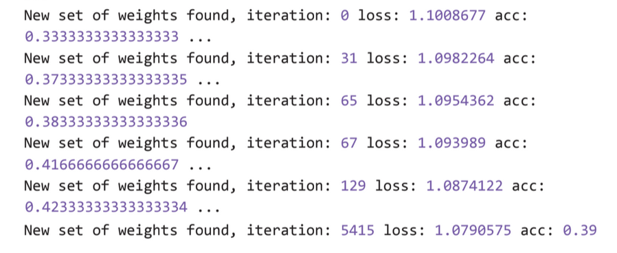
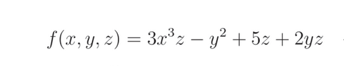
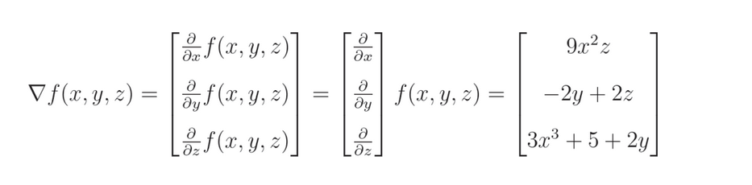
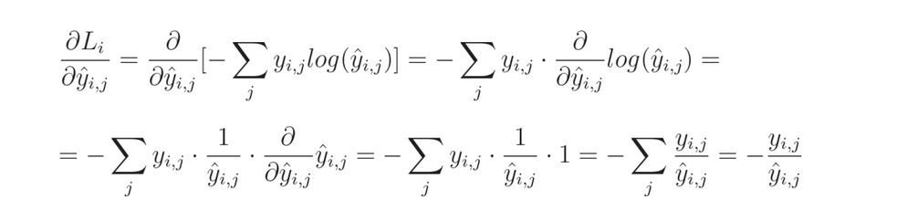
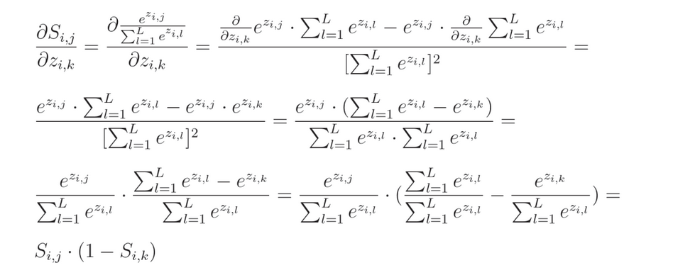
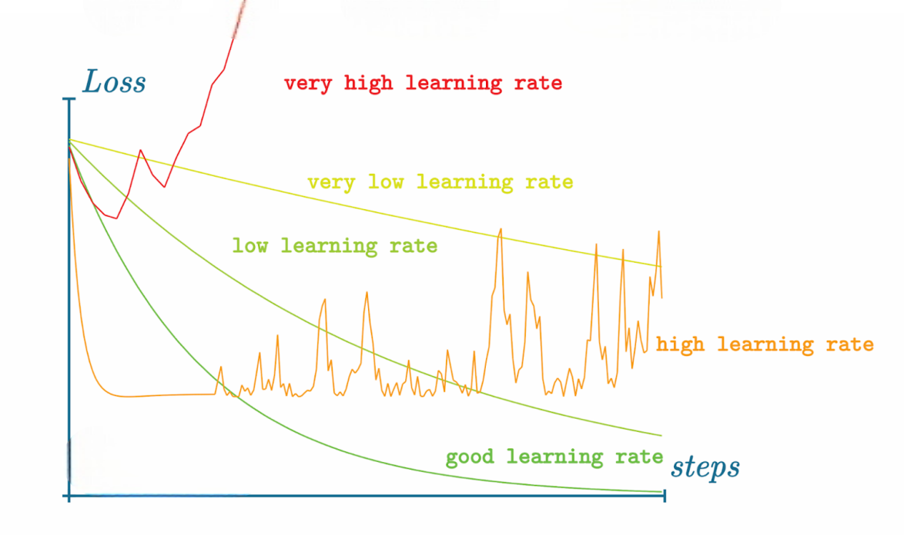
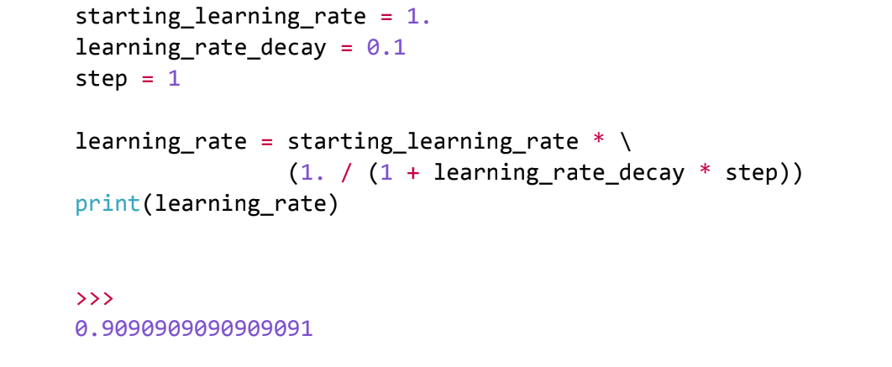

# Neural Networks from Scratch

Welcome to the **Neural Networks from Scratch** repository. This project is a comprehensive guide for building neural networks from the ground up, providing detailed explanations and code implementations for every component. This repository is ideal for learners and educators in the fields of artificial intelligence and machine learning.

## Table of Contents

1. [Introducing Neural Networks](#introducing-neural-networks)
2. [Coding Our First Neurons](#coding-our-first-neurons)
3. [Adding Layers](#adding-layers)
4. [Activation Functions](#activation-functions)
5. [Calculating Network Error with Loss](#calculating-network-error-with-loss)
6. [Introducing Optimization](#introducing-optimization)
7. [Derivatives](#derivatives)
8. [Gradients, Partial Derivatives, and the Chain Rule](#gradients-partial-derivatives-and-the-chain-rule)
9. [Backpropagation](#backpropagation)
10. [Optimizers](#optimizers)
11. [Testing with Out-of-Sample Data](#testing-with-out-of-sample-data)
12. [Validation Data](#validation-data)
13. [Training Dataset](#training-dataset)
14. [L1 and L2 Regularization](#l1-and-l2-regularization)
15. [Dropout](#dropout)
16. [Binary Logistic Regression](#binary-logistic-regression)
17. [Regression](#regression)
18. [Model Object](#model-object)
19. [A Real Dataset](#a-real-dataset)
20. [Model Evaluation](#model-evaluation)
21. [Saving and Loading Models and Their Parameters](#saving-and-loading-models-and-their-parameters)
22. [Prediction / Inference](#prediction-inference)

## Introducing Neural Networks
Originally known as artificial neural networks, neural networks are computational 
models inspired by the human brain. They consist of interconnected layers of nodes 
or neurons that process data, enabling machines to learn patterns and make decisions.
They find applications in almost everything.
## Coding Our First Neurons
Step-by-step guide to Fully Connected Artificial Neural Network, layers of neurons, 
and operations like dot products and matrix multiplications using pure python. 
For detailed code examples, refer to the [FullyConnectedNN From Scratch](models/FullyConnectedNN.py)

## Adding Layers
Learn how to add and train dense layers in your neural network models. 
Implementing dense layers, which are fully connected layers where each neuron 
receives input from all neurons in the previous layer, has been pivotal in 
deep learning advancements.Dense layers allow for complex pattern 
learning and model flexibility. It is implemented from scratch using Numpy on there [Dense From Scratch](models/Dense.py)

## Activation Functions
**ReLU** - is widely used for its simplicity, computational efficiency, and effectiveness in handling vanishing gradients(Gradients become extremely small) in deep networks. [ReLU From Scratch](activation/ReLU.py)

**SoftMax** - is essential for multi-class classification problems, converting logits(numbers) into probabilities, making it easier to interpret model outputs and compare class scores. [SoftMax From Scratch](activation/SoftMax.py)
## Calculating Network Error with Loss
**Categorical Cross-Entropy** -Categorical cross-entropy loss is widely used in classification tasks, it measures the difference between true and predicted probabilities.It is beneficial for multi-class problems. Lower loss indicates higher confidence in correct predictions (e.g., 0.99 probability yields low loss, approaching zero).
[Categorical Cross-Entropy From Scratch](loss/CategoricalCrossEntropy.py)
## Introducing Optimization
The next step is determining how to adjust the weights and biases 
to decrease the loss. Initially, one might think of changing them randomly, 
but experiments show this is not effective. Instead, 
we use calculus to optimize these adjustments. 😊 

You can see the results after using the random approach

## Derivatives
The random approach does not yield good results. 
Instead, we use calculus, particularly derivatives,
to measure changes in variables. This method involves using the
slopes of functions to optimize our neural networks. Basically we calculate
how much each singular weight and bias change the loss value. For that we are going to
use **Gradient Descent** which is result of the calculation of the partial derivatives and then
we'll **Backpropagate** it using **Chain Rule**.

More About Calculus: https://en.wikipedia.org/wiki/Calculus

## Gradients, Partial Derivatives, and the Chain Rule
**Gradient**: The gradient is a vector consisting of the partial derivatives with respect to each of the inputs.

**Partial Derivatives**: Measures how much impact a single input has on a function's output

If the function is following 

Then Partial Derivatives and gradient will be following
 

**Chain Rule**: The chain rule is used in neural networks during backpropagation 
to compute gradients of the loss function. Loss is a big function
or a chain of functions of multiple inputs.

For instance, if we have two function z=f(x) and y=g(z)
We can represent this equation as y=g(f(x)), As you can see there 
is function inside the function
and as calculus says derivative of y will be y'=g(f(x))' * f(x)'

## Backpropagation
Backpropagation is a key algorithm in training neural networks, 
enabling weight adjustment to minimize error. It measures the gradient of 
the loss function with respect to each weight by propagating errors backward 
through the network. Essential for gradient descent optimization, it enhances 
model accuracy. 

Step 1 -> Compute Gradient of Loss Function

Step 2 -> Backpropagate the Gradient

step 3 -> Adjust Weights

**Categorical Cross-Entropy Loss Derivative:**

Full solution 
Code On there: [CategoricalCrossEntropy](loss/CategoricalCrossEntropy.py)

**Softmax Derivative:** 

Full Solution:

Code On there: [SoftMax](activation/SoftMax.py)

## Optimizers

**Stochastic Gradient Descent (SGD):** Once we have calculated gradients we can use 
this information to adjust weights and biases to decrease the loss. I'm going to implement
SGD where after each step/epoch gradient is changed by small portion in order to decrease loss.
[SGD](optimizers/SGD.py)

**Learning Rate:** Lr is hyperparameter if it is too low small updates to
derivatives cause the model to stuck in a local minimum, If it is high 
loss will start jumping, and results weired loss for each epoch, 
No more words just look at the image (:

In most cases we want to start with a larger learning rate and decrease the learning rate over time/steps/epochs.
Commonly used solution explore various learning rate during training is to implement **Learning Rate Decay**

This is "formula" for that: 

step increase causes learning rate decrease, lets visualize it for 20 epoch

## Testing with Out-of-Sample Data
**SOON 🔜  **Techniques for testing neural network models with out-of-sample data to evaluate their performance.

## Validation Data
**SOON 🔜  ** Methods for using validation data during model training to prevent overfitting.

## Training Dataset
**SOON 🔜  **Guidelines for preparing and using training datasets effectively.

## L1 and L2 Regularization
**SOON 🔜  **Implement regularization techniques to improve model generalization.

## Dropout
**SOON 🔜  ** Learn about dropout techniques to prevent overfitting in neural networks.

## Binary Logistic Regression
**SOON 🔜  ** Detailed guide to implementing binary logistic regression and binary cross-entropy loss.

## Regression
**SOON 🔜  ** Explore regression techniques, including mean squared error and mean absolute error, with code examples.

## Model Object
**SOON 🔜  **Creating and using model objects for easier neural network management.

## A Real Dataset
**SOON 🔜  ** Practical guide to working with real datasets, including data preparation, loading, preprocessing, and training.

## Model Evaluation
**SOON 🔜  ** Methods for evaluating neural network models to ensure they perform well on unseen data.

## Saving and Loading Models and Their Parameters
**SOON 🔜  ** Techniques for saving and loading models and their parameters for reuse.

## Prediction / Inference
**SOON 🔜  ** Guidelines for making predictions and performing inference with trained neural network models.

---

This repository aims to be a thorough, hands-on guide to neural networks. Happy learning and coding!
