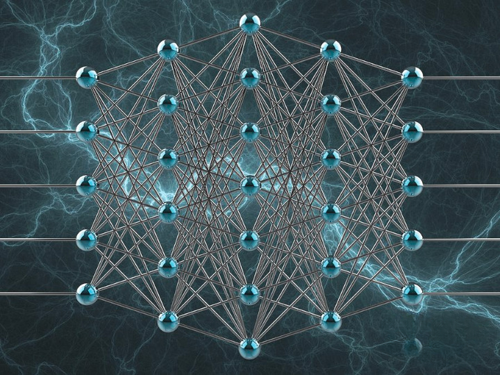
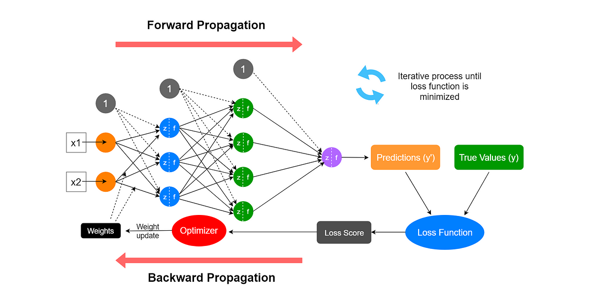
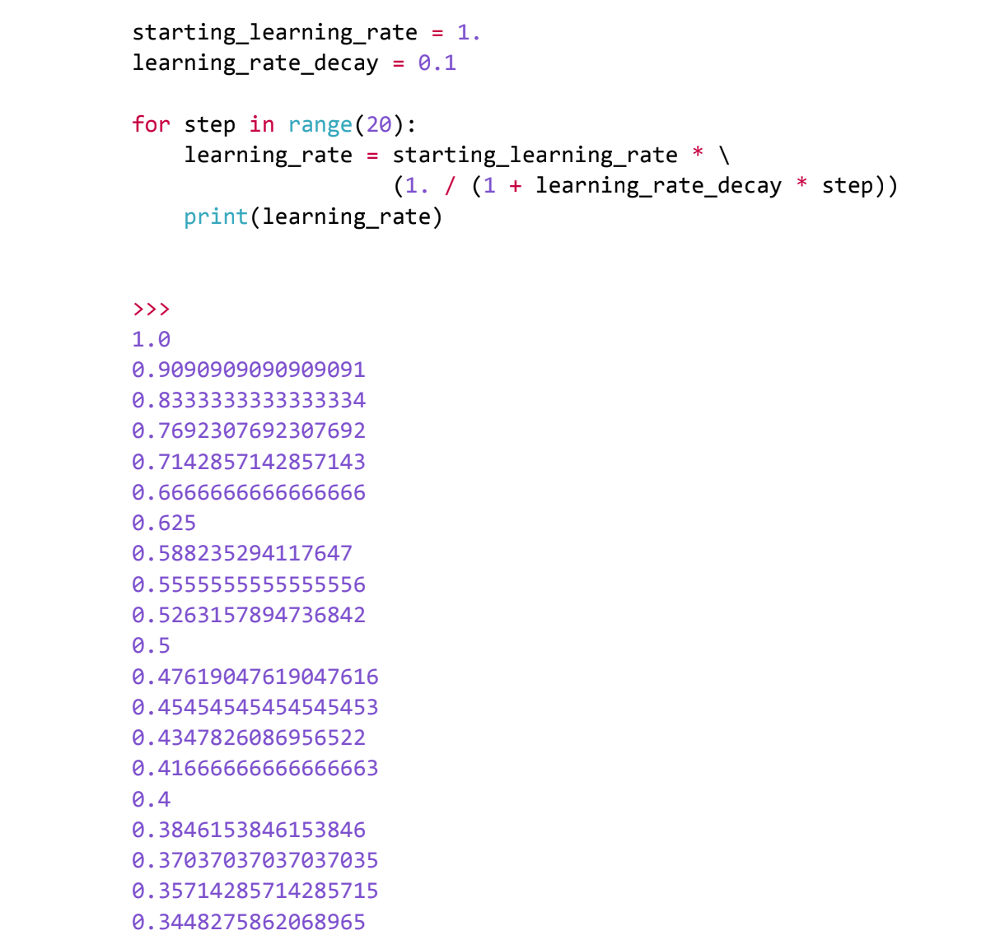
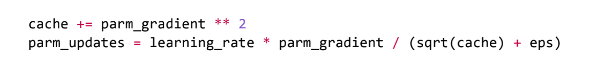
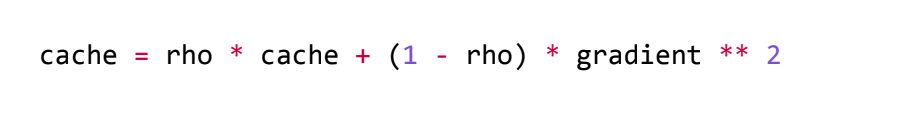
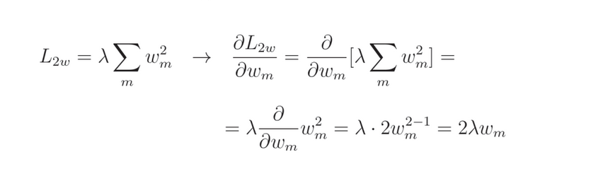
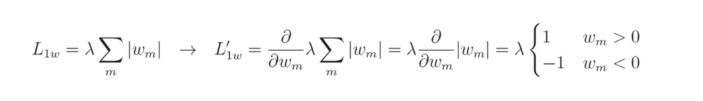
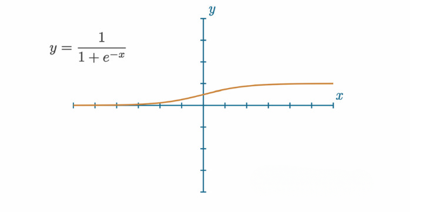
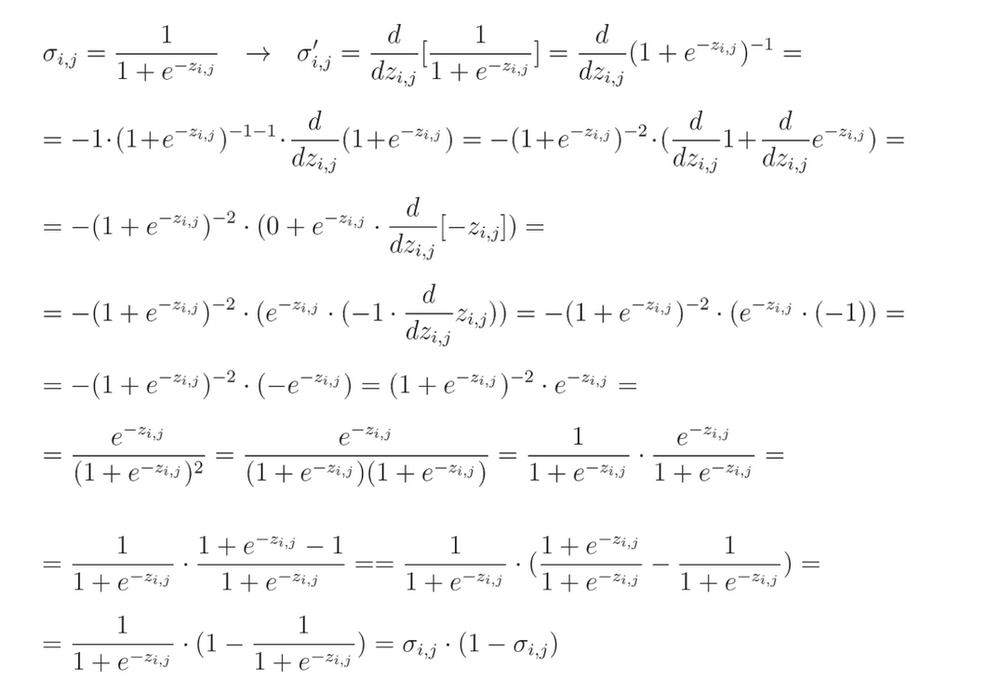
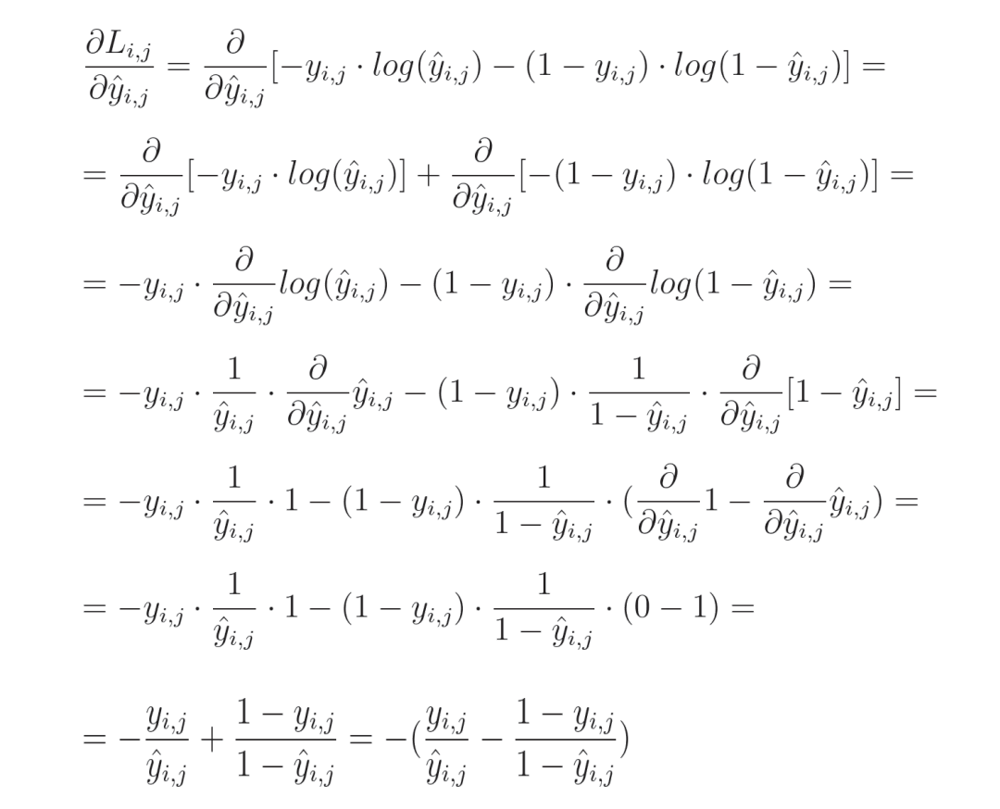

# Neural Networks from Scratch

Welcome to the **Neural Networks from Scratch** repository. This project is a comprehensive guide for building neural networks from the ground up, providing detailed explanations and code implementations for every component. This repository is ideal for learners and educators in the fields of artificial intelligence and machine learning.

## Table of Contents

1. [Introducing Neural Networks](#introducing-neural-networks)
2. [Coding Our First Neurons](#coding-our-first-neurons)
3. [Adding Layers](#adding-layers)
4. [Activation Functions](#activation-functions)
5. [Calculating Network Error with Loss](#calculating-network-error-with-loss)
6. [Introducing Optimization](#introducing-optimization)
7. [Derivatives](#derivatives)
8. [Gradients, Partial Derivatives, and the Chain Rule](#gradients-partial-derivatives-and-the-chain-rule)
9. [Backpropagation](#backpropagation)
10. [Optimizers](#optimizers)
11. [Testing with Out-of-Sample Data](#testing-with-out-of-sample-data)
12. [Dropout](#dropout)
13. [Binary Logistic Regression](#binary-logistic-regression)
14. [Regression](#regression)
15. [Model Object](#model-object)
16. [A Real Dataset](#a-real-dataset)
17. [Model Evaluation](#model-evaluation)
18. [Saving and Loading Models and Their Parameters](#saving-and-loading-models-and-their-parameters)
19. [Prediction / Inference](#prediction-inference)

## Introducing Neural Networks
Originally known as artificial neural networks, neural networks are computational 
models inspired by the human brain. They consist of interconnected layers of nodes 
or neurons that process data, enabling machines to learn patterns and make decisions.
They find applications in almost everything.

This is pretty visual representation of neural net (:

But this is actual (:

More actual is just numbers (:

## Coding Our First Neurons
Step-by-step guide to Fully Connected Artificial Neural Network, layers of neurons, 
and operations like dot products and matrix multiplications using pure python. 
For detailed code examples, refer to the [FullyConnectedNN From Scratch](models/FullyConnectedNN.py)

## Adding Layers
Learn how to add and train dense layers in your neural network models. 
Implementing dense layers, which are fully connected layers where each neuron 
receives input from all neurons in the previous layer, has been pivotal in 
deep learning advancements.Dense layers allow for complex pattern 
learning and model flexibility. It is implemented from scratch using Numpy on there [Dense From Scratch](models/Dense.py)

## Activation Functions
**ReLU** - is widely used for its simplicity, computational efficiency, and effectiveness in handling vanishing gradients(Gradients become extremely small) in deep networks. [ReLU From Scratch](activation/ReLU.py)

**SoftMax** - is essential for multi-class classification problems, converting logits(numbers) into probabilities, making it easier to interpret model outputs and compare class scores. [SoftMax From Scratch](activation/SoftMax.py)
## Calculating Network Error with Loss
**Categorical Cross-Entropy** -Categorical cross-entropy loss is widely used in classification tasks, it measures the difference between true and predicted probabilities.It is beneficial for multi-class problems. Lower loss indicates higher confidence in correct predictions (e.g., 0.99 probability yields low loss, approaching zero).
[Categorical Cross-Entropy From Scratch](loss/CategoricalCrossEntropy.py)
## Introducing Optimization
The next step is determining how to adjust the weights and biases 
to decrease the loss. Initially, one might think of changing them randomly, 
but experiments show this is not effective. Instead, 
we use calculus to optimize these adjustments. 😊 

You can see the results after using the random approach

## Derivatives
The random approach does not yield good results. 
Instead, we use calculus, particularly derivatives,
to measure changes in variables. This method involves using the
slopes of functions to optimize our neural networks. Basically we calculate
how much each singular weight and bias change the loss value. For that we are going to
use **Gradient Descent** which is result of the calculation of the partial derivatives and then
we'll **Backpropagate** it using **Chain Rule**.

More About Calculus: https://en.wikipedia.org/wiki/Calculus

## Gradients, Partial Derivatives, and the Chain Rule
**Gradient**: The gradient is a vector consisting of the partial derivatives with respect to each of the inputs.

**Partial Derivatives**: Measures how much impact a single input has on a function's output

If the function is following 

Then Partial Derivatives and gradient will be following
 

**Chain Rule**: The chain rule is used in neural networks during backpropagation 
to compute gradients of the loss function. Loss is a big function
or a chain of functions of multiple inputs.

For instance, if we have two function z=f(x) and y=g(z)
We can represent this equation as y=g(f(x)), As you can see there 
is function inside the function
and as calculus says derivative of y will be y'=g(f(x))' * f(x)'

## Backpropagation
Backpropagation is a key algorithm in training neural networks, 
enabling weight adjustment to minimize error. It measures the gradient of 
the loss function with respect to each weight by propagating errors backward 
through the network. Essential for gradient descent optimization, it enhances 
model accuracy. 

Step 1 -> Compute Gradient of Loss Function

Step 2 -> Backpropagate the Gradient

step 3 -> Adjust Weights

**Categorical Cross-Entropy Loss Derivative:**

Full solution 
Code On there: [CategoricalCrossEntropy](loss/CategoricalCrossEntropy.py)

**Softmax Derivative:** 

Full Solution:

Code On there: [SoftMax](activation/SoftMax.py)

## Optimizers

**Stochastic Gradient Descent (SGD):** Once we have calculated gradients we can use 
this information to adjust weights and biases to decrease the loss. I'm going to implement
SGD where after each step/epoch gradient is changed by small portion in order to decrease loss.
[SGD](optimizers/SGD.py)

**Learning Rate:** Lr is hyperparameter if it is too low small updates to
derivatives cause the model to stuck in a local minimum, If it is high 
loss will start jumping, and results weired loss for each epoch, 
No more words just look at the image (:

In most cases we want to start with a larger learning rate and decrease the learning rate over time/steps/epochs.
Commonly used solution explore various learning rate during training is to implement **Learning Rate Decay**

This is "formula" for that: 

step increase causes learning rate decrease, lets visualize it for 20 epoch

This approach is fair but only follows gradient updates without any additional 
logic that could potentially help the model find the global minimum to the loss function. 
One option for improving SGD is to introduce **MOMENTUM**

**Momentum:** Creates a rolling average of gradients over some number 
of updates and uses this average with the unique gradient at each step.
Momentum may still point toward the global gradient descent direction. The 
update contains a portion of the gradient from preceding steps as our momentum
and only a portion of the current gradient.

**AdaGrad:** AdaGrad is short for adaptive gradient. Main idea is to
normalize updates made to the features. During the training process, some weights
can rise significantly, while others tend to not change by much. AdaGrad
provides a way to normalize parameter updates by keeping a history of previous updates
**The bigger the sum of the update is, in either direction, the smaller updates are made further in training.**
Which lets less-frequently updated parameters to keep-up with changes, utilizing more neurons for training.

This Is AdaGrad In Nutshell:

**Cache:** holds history of squared gradients.
**parm_updates:** is function of the learning rate multiplied by the gradient and then 
divided by the sqrt of root of the cache plus some **epsilon**(epsilon value is usually a small such as 1e-8, avoid division by zero)

AdaGrad(Adaptive Gradient) From Scratch:[AdaGrad](optimizers/AdaGrad.py)

**RMSProp:** Full name is **Root Mean Square Propagation**. It is similar to AdaGrad but calculation
happens in different way, where AdaGrad calculates cache as squared gradients, RMSProp have following approach:

In this way learning rate changes are smoother. **rho(hyperparameter):** is the cache memory decay rate. 

**Adam:** Short for **Adaptive Momentum** is currently most widely-used optimizer and is built
atop RMSProp, with the momentum concept from SGD added back in.Adam optimizer works well with large 
datasets and sparse data, helping models learn faster and more reliably. 

**It is usually good to try Adam optimizer first and then others. Choosing optimizer
depends on problem type but if problem is too complex just try different ones
and choose the best (:**
## Testing with Out-of-Sample Data
Out-of sample data is just unseen data by neural net. Our task is to minimize loss
and **generalize** the model, this is where regularization comes into play. L1 and L2 regularization
is used like penalty and added to overall loss.

**L1 Regularization:** It is sum of all the absolute values for weights and biases.

**L2 Regularization:** Is the sum of the squared weights and biases.

**L1 regularization is rarely used alone because of its nature of linearity, It 
mostly used with L2.**

**Overall Loss = DataLoss + L1weight + L2bias + L2weight + L2bias**

**Regularization losses are calculated separately **

This is for forward pass: [L1 and L2 regularization loss](loss/Loss.py)

Implementing this means that overall loss is changed which must be accounting in to backpropagation.
We need to cover derivatives of L1 nad L2 regularization.

L2 regularization derivative is straightforward: 

L1 is a bit of complicated:  This simply happens because of absolute value.

There is L1 and L2 taking into consideration for backward pass: [backward](models/Dense.py)

## Dropout
Another approach for neural net regularization is adding a **Dropout Layer**. Idea
is that to prevent neural net from becoming too dependent on any neuron. This is very straightforward
you should disable some percentage neurons during every froward pass. Dropout does not
disable neurons it just set them to zero. **While dropout helps neural net generalize it's not 
something that we want to utilize when predicting. **

**Dropout From Scratch:** [Dropout](dropout/Dropout.py)

## Binary Logistic Regression
**Binary Logistic Regression:** Is used when outcome is binary. For example, Spam detection,
I help us to distinguish between whether message is spam or not. 0 or 1. It is used with Sigmoid 
Activation function, which approaches both maximum and minimum values exponentially fast, this property 
makes the Sigmoid activation function a good candidate to apply to the final layer's output.

Graph and function of Sigmoid:

Derivative of sigmoid:

Sigmoid Implementation: [Sigmoid From Scratch](activation/Sigmoid.py)

**Binary Cross-Entropy Loss:** Binary cross entropy loss measures how well
predicted probabilities match true binary labels. It penalizes deviations 
using logarithmic loss. After loss is calculated, we need to find mean of this loss
to find average loss.

For backward pass there is Binary Cross-Entropy Loss Derivative:

Then we need to find mean of this, and using chain rule we will multiply it by 1/J.

Full code for forward/backward pass: [Binary Cross-Entropy From Scratch](loss/BinaryCrossEntropy.py)

## Regression
I've been working with classification models so far, where we try to determine
what something is based on probabilities. In case of **Regression** we are trying to
predict some number, for example what stock price will be in 5 years from now. Approach 
is different, result is different, and consequently we need different ways to measure loss, also
we have different data, and we have to approach it in other way.

**Linear Activation:** I'm going to use linear activation function fo the output layer.

Code: [Binary Cross-Entropy From Scratch](activation/Linear.py)

## Model Object
**SOON 🔜  **Creating and using model objects for easier neural network management.

## A Real Dataset
**SOON 🔜  ** Practical guide to working with real datasets, including data preparation, loading, preprocessing, and training.

## Model Evaluation
**SOON 🔜  ** Methods for evaluating neural network models to ensure they perform well on unseen data.

## Saving and Loading Models and Their Parameters
**SOON 🔜  ** Techniques for saving and loading models and their parameters for reuse.

## Prediction / Inference
**SOON 🔜  ** Guidelines for making predictions and performing inference with trained neural network models.

---

This repository aims to be a thorough, hands-on guide to neural networks. Happy learning and coding!
